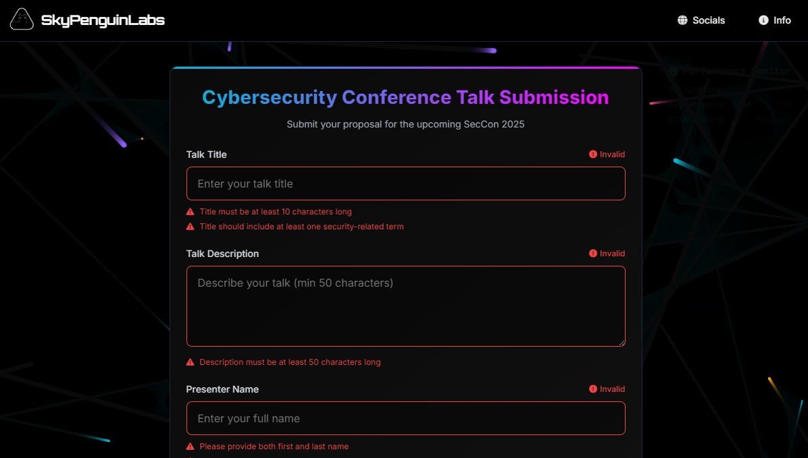
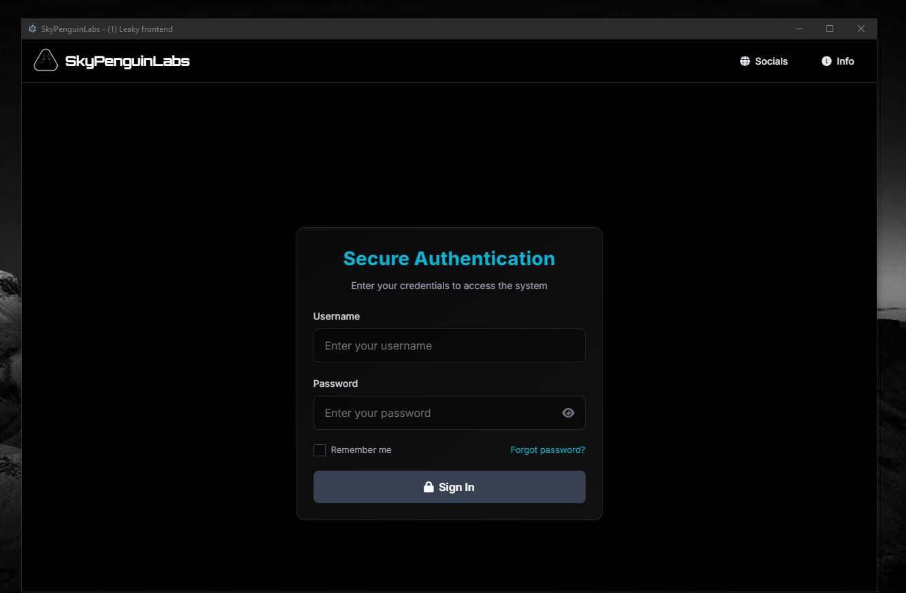

### Demo Apps for Course: The Art of Frontend Validation for UX

The table below defines all of the applications and their purpose/relevance to the course, and what should be done to set them up.

> [!NOTE]
> Click the app name to download it from [skypenguinlabs](https://skypenguinlabs.wtf)

### App Catalog 

| Application name | Application purpose | Sha 1 Hash |
| ---------------- | ------------------- | ---------------- | 
| [DemoApp1](https://skypenguinlabs.wtf/DownloadableCourseApps/PRGC3/App1/App1.exe) | The first application you get walked through. Requires no setup. It is simply just click-to-run. A positive example of good frontend validation | 0c14d7cedb8b332a41c215ec6d97d1fb0171739b |
| [DemoApp2](https://skypenguinlabs.wtf/DownloadableCourseApps/PRGC3/App2/App2.exe) | The second ElectronJS application you get walked through. Also requires no setup and click-to-run. This one simply verifies information incorrectly. | 7ce561dd0c3fffcb0d6900228ea970272f8d0af4 |
| [Demoapp3](https://skypenguinlabs.wtf/DownloadableCourseApps/PRGC3/App3/App3.exe) | The third ElectronJS app that you can run in this course is an AI slop of  non-performant code, to walk you through what it can result in. | ddb70261d03eded7ecd263eb5719c8c45deb8ac1 | 

### Required Environment

N/A - Reason: These are executables built for Windows. Windows 10 is all thats required to run these applications

### Screenshots / Demo app samples 

> AI Generated Messes!

> Human engineered smooth examples.... (♡﹃♡)(♡﹃♡)(♡﹃♡)(♡﹃♡)(♡﹃♡)(♡﹃♡)(♡﹃♡)

