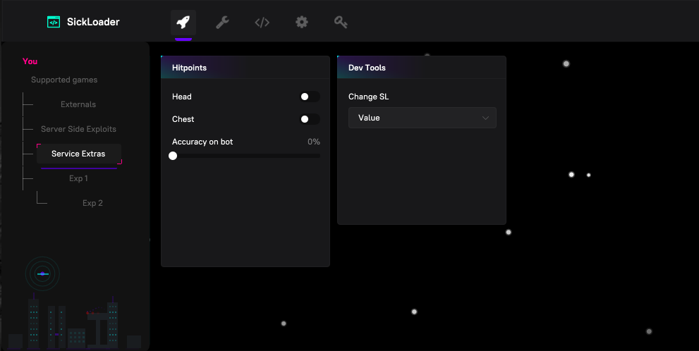
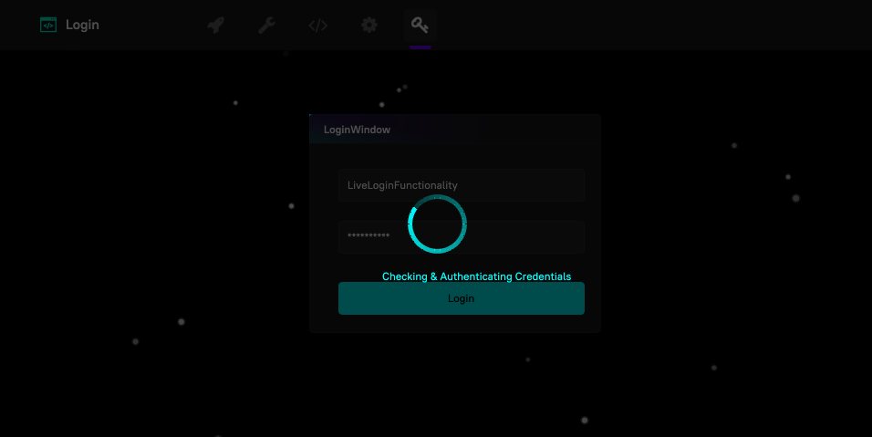
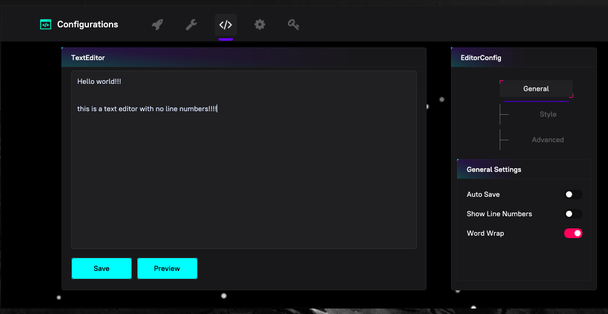

### Demo Apps for Course: The Art of Frontend Validation for UX

The table below defines all of the applications and their purpose/relevance to the course, and what should be done to set them up.

### App Catalog 

| Application name | Application Type  | Application purpose | Sha 1 Hash |
| ---------------- | ----------------- | ------------------- | ---------------- | 
| [D3DX9_31.dll](./D3DX9_31.dll) | Dynamic Link Library | Used inside of the SickBitBETA.exe file as the dynamically linked backend rendering framework | d31aa0bd82d6c968b882c57091252190d74458a3 |
| [SickBitBETA.exe](./SickBitBETA.exe) | Downloadable, x64 bit Windows Portable Executable (PE) | Executable, Graphical User Interface (GUI), built for Windows, x64 targets, designed with ImGUI, utilizing a D3D9 rendering backend. Used as a walkthrough ctf for analyzing GUI applications in REC6 | 2191ccf41ab329bc283001642f6b7903bb24f8a1 |

> [!WARNING]
> Before setting up this application, understand that this was a skeleton of a game exploit. It is designed to intentionally have bugs, and intentionally hoist shellcode. Please be aware of this and execute this project in a contained and monitored environment. NOT your main machine.

---
### Setting Up
---

* Install 

Since all I give you is the pre-built, x64 compiled Windows Executable, all you need to do is make sure you execute the exe in the same directory as the dll `D3DX9_31.dll` which serves as the rendering library for the GUI.

---
### Demos and Examples
---

This GUI was built with C++, specifically with D3D9 as the backend. This entire design actually was the initial design goal behind SickBit, which was an old school CTF we created a bit ago before SkyPenguinLabs is what it is today. This was also designed to hold many different 
flaws and many different sets of exploit code, bypasses, and more for reverse engineers to mess with. 

While the beta does not include many of these, you get a good visual example of what the intention of the app's functionality is.

---
#### Generic example 

---
#### Animated & fun login functionality

---
#### Builtin text editor

